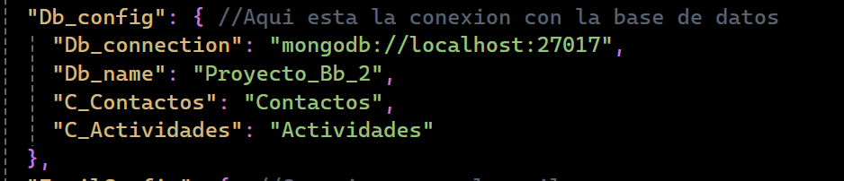
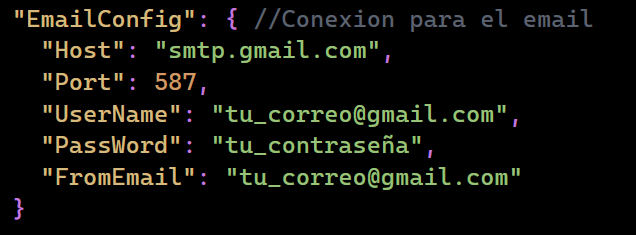

# Modificaciones Permitidas

Este proyecto está protegido bajo una **Licencia de Uso Restringido**. Sin embargo, se permiten modificaciones en las siguientes partes del código:

## Partes Modificables

**1 Archivo `appsettings.json`**:

Puedes modificar la cadena de conexión de MongoDB y el nombre de la base de datos para adaptarlo a tu entorno local o de producción.

**Cadena de conexión**: Cambia `mongodb://localhost:27017` por la conexión de tu base de datos creada. MongoDB usa este puerto por defecto, pero puedes modificarlo según tu configuración. 

**Nombre de la base de datos**: Cambia `Proyecto_Bb_2` por el nombre de tu base de datos creada.

Los nombres de las colecciones (`Contactos` y `Actividades`) son opcionales. Si no los modificas, el sistema creará automáticamente dos colecciones con esos nombres por defecto.

**2 Configuración de notificaciones por correo** (si aplica):

Para habilitar las notificaciones por correo, debes configurar la sección `EmailConfig` en el archivo `appsettings.json`.

- **Host**: Usa `smtp.gmail.com` para Gmail o el servidor SMTP de tu proveedor de correo o cambialo segun tu proveedor de correo.
- **Port**: El puerto `587` es común para conexiones SMTP seguras pero puedes usar cualquier otra.
- **UserName**: Ingresa tu dirección de correo electrónico (por ejemplo, `tu_correo@gmail.com`).
- **PassWord**: Ingresa la contraseña de tu correo electrónico. 
- **FromEmail**: Este campo debe coincidir con tu dirección de correo electrónico.

## Solicitud de Permisos Adicionales

Si necesitas realizar modificaciones fuera de las partes permitidas, contacta al autor del proyecto:

- **Nombre**: Juan Jose Tito Escobar
- **Email**: juan.tito.dev@gmail.com

---

**Nota**: Cualquier modificación no autorizada en partes no permitidas constituye una violación de los términos de la licencia.