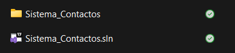
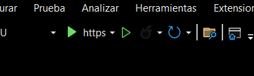
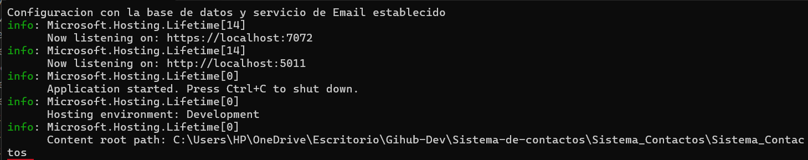
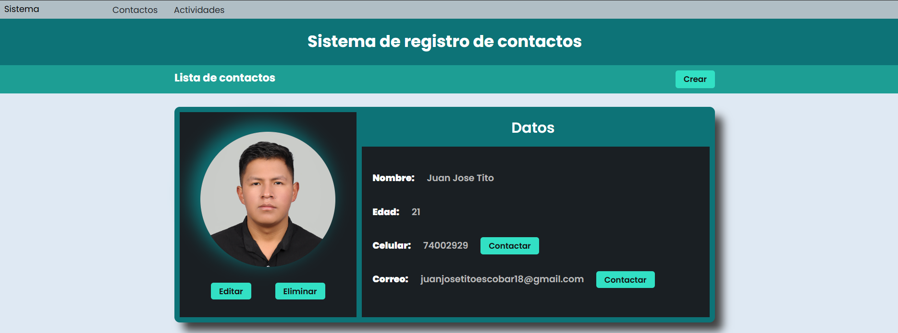
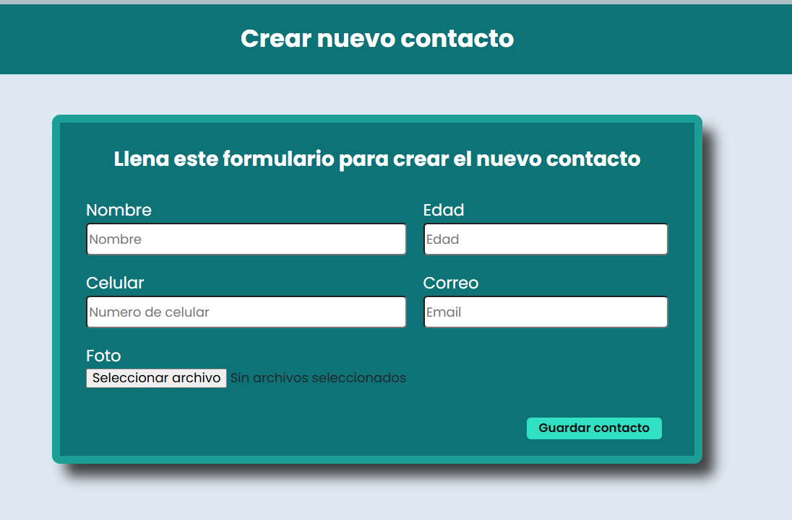
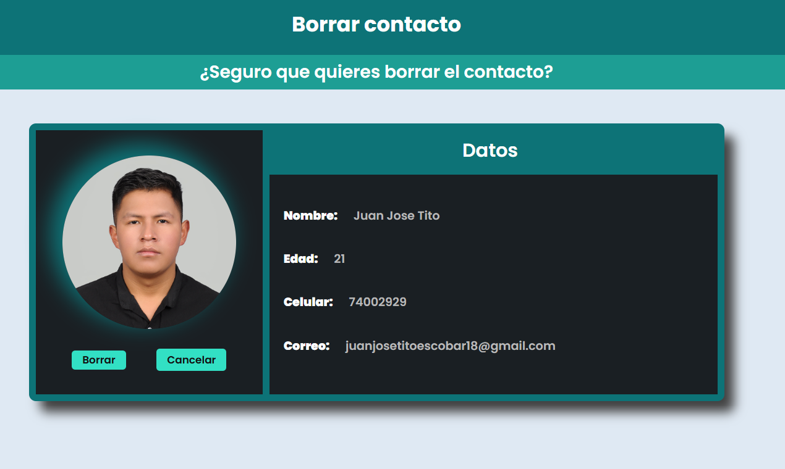
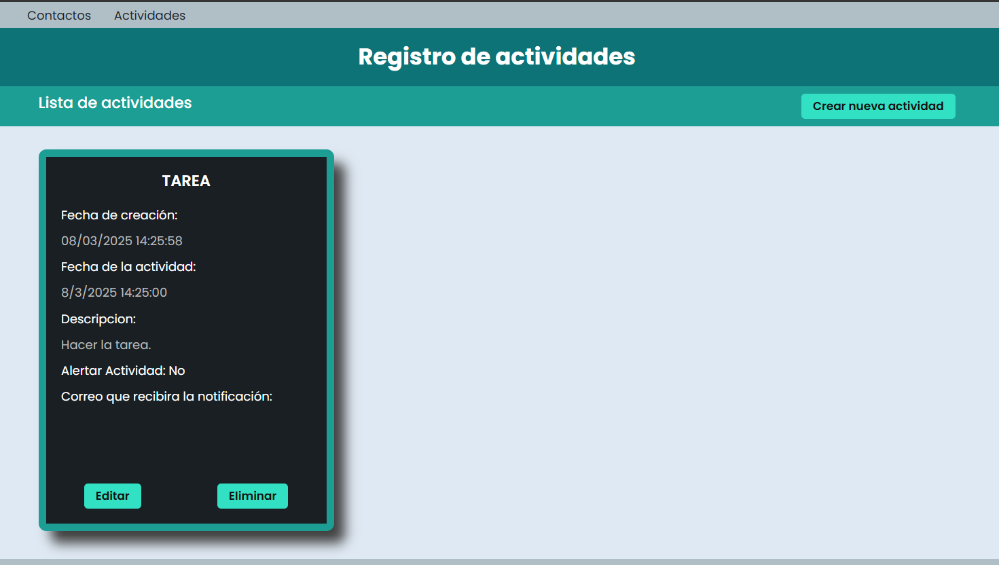
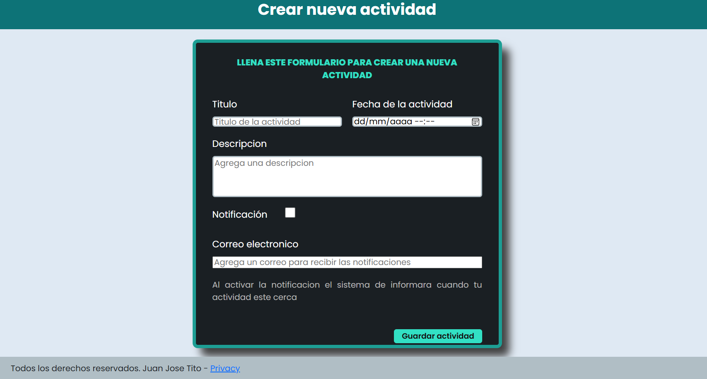
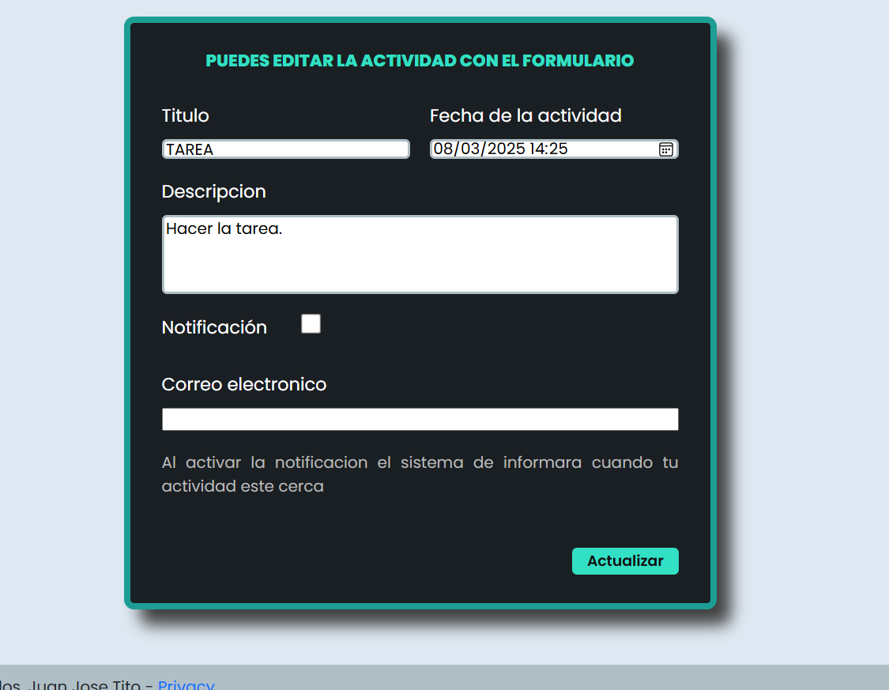
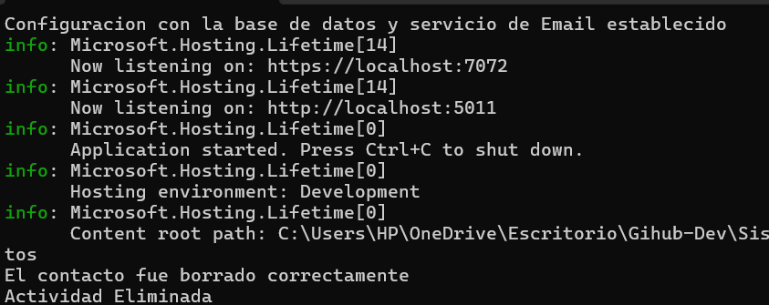

# Sistema de Contactos


## Descripción

Este es un proyecto universitario de un **Sistema de Contactos y actividades** desarrollado en **ASP.NET Core** con una base de datos **MongoDB**. Con fines de aprendisaje. Permite gestionar contactos y actividades, ofreciendo funcionalidades:

### Contactos
- **Crear contacto**: Añade un contacto con nombre, número de celular y una foto (opcional).
- **Editar contacto**: Modifica la información de un contacto existente.
- **Contactar**: Redirecciona a **WhatsApp** para comunicarte directamente con el contacto.
- **Eliminar contacto**: Elimina un contacto de la lista.

### Actividades
- **Crear actividad**: Añade una actividad con nombre, descripción, fecha y hora de realización.
- **Notificaciones**: Recibe alertas en tu correo electrónico antes de que la actividad comience.
- **Eliminación automática**: Las actividades se eliminan automáticamente después de su fecha y hora de realización.
- **Eliminación manual**: También puedes eliminar actividades de forma manual.

## Características Principales

- **Tecnologías utilizadas**: ASP.NET Core, MongoDB.
- **Arquitectura**: MVC.
- **Integración con WhatsApp**: Redirección directa para contactar a los números guardados.
- **Notificaciones por correo**: Alertas de actividades programadas.

## Requisitos Previos

Antes de ejecutar este proyecto, asegúrate de tener instalado lo siguiente:

- **Visual Studio 2022** o superior. <!-- Especifica la versión mínima si es necesario -->
- **.NET 8** o superior. <!-- Asegúrate de que sea compatible con tu proyecto -->
- **MongoDB**: Recomendamos usar [MongoDB Community Server](https://www.mongodb.com/try/download/community) junto con **MongoDB Compass** para una gestión visual de la base de datos.

## Instalación

Sigue estos pasos para configurar y ejecutar el proyecto localmente:

**Clona el repositorio**:

```bash
git clone https://github.com/JuanTito-Dev/sistema-de-contactos.git

cd sistema-de-contactos
```
## Cómo Utilizar

Antes de usar esta aplicación, sigue estos pasos para configurar la base de datos y la conexión:

**Crear una base de datos en MongoDB**:
- Abre **MongoDB Compass** o tu cliente de MongoDB preferido.
- Crea una nueva base de datos con el nombre que desees (por ejemplo, `SistemaDeContactos`).
- Luego abre el archivo Sistema_Contactos.sin



Se abrira Visual studio y podras preciar el codigo.

**Modificaciones permitidas**:

Antes de correr o ejecutar la aplicacion web debes de hacer unas moficaciones al codigo solo las permitidas.

- Solo se permiten modificaciones en el codigo en las partes especificadas en el archivo [Modificaciones](MODIFICACIONES_PERMITIDAS.md).
- No modifiques otras partes del código sin autorización explícita.

## Ejecuta el programa



con el boton verde.

## Notas
- Si no ejecuta revisa que la conexion a la base de datos no tenga ningun error.
si todo sale bien te saldra esto.



## Capturas de Pantalla

A continuación, se muestran algunas capturas de pantalla de la aplicación en funcionamiento:

**Contactos**







**Actividades**







## Sugerencias 

- El uso de gmeil es hasta 100 mensajes diarios para no exceder los limites de envios de gmail.
- Revisar la consola ya que cualquier proceso que realizae el sistema lo avisa en la consola.


## Licencia

Este proyecto está protegido bajo una **Licencia de Uso Restringido**. Consulta el archivo [LICENSE](LICENSE.TXT) para más detalles. Solo se permiten modificaciones en las partes especificadas en [MODIFICACIONES_PERMITIDAS.md](MODIFICACIONES_PERMITIDAS.md).

**Nota**: Cualquier uso no autorizado, modificación o redistribución del código constituye una violación de los términos de la licencia.

## Contacto

Si tienes alguna pregunta o sugerencia, no dudes en contactarme:

- **Nombre**: Juan Jose Tito Escobar
- **Email**: juan.tito.dev@gmail.com